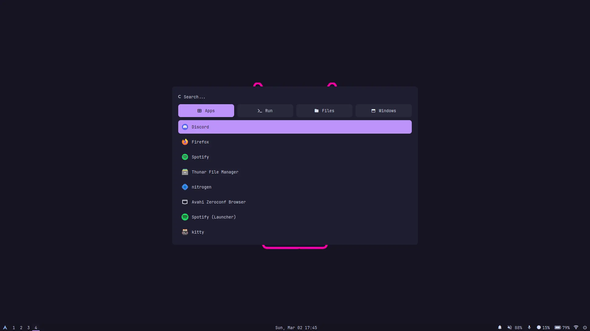
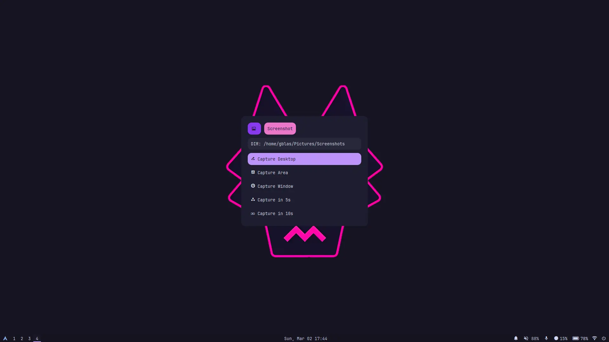
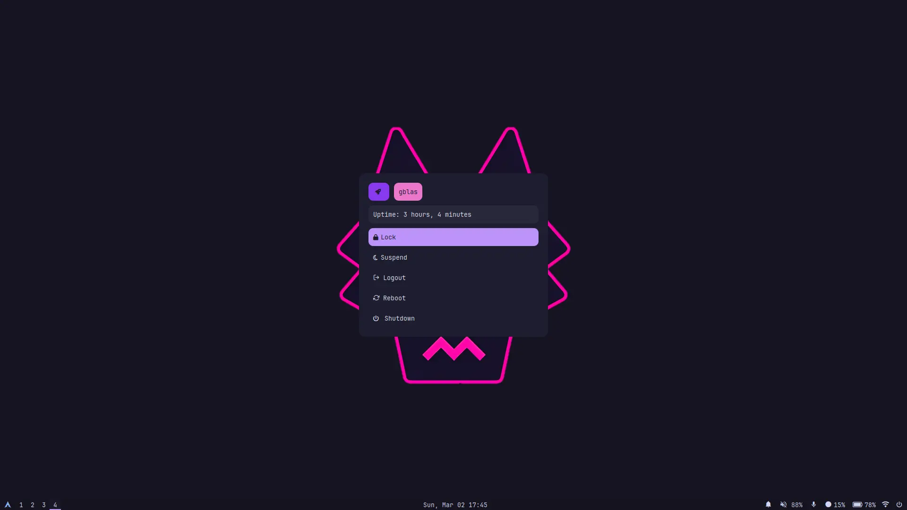
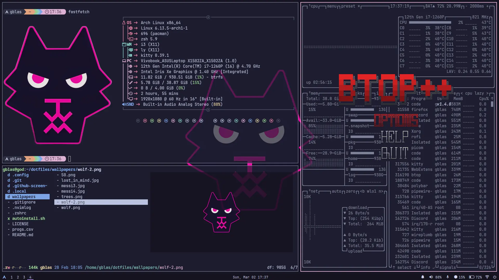
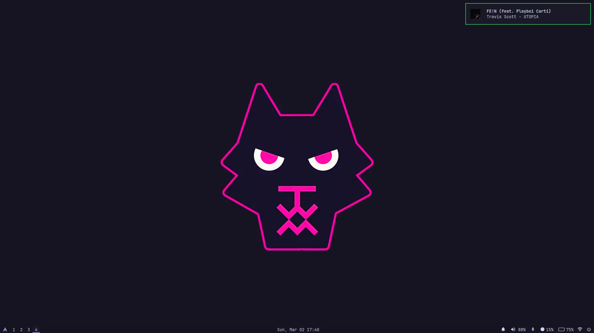

# My Dotfiles

This set of configurations is the environment I work in every day. It is designed to be used with [Arch Linux](https://archlinux.org/). These dotfiles include a variety of tools and settings that enhance my workflow and productivity, from the window manager (i3) to development tools like Neovim, file management utilities, app launchers, and more.


## Tools

- Window Manager (WM): [i3](https://i3wm.org/).
- Display Manager (DM): [Ly](https://github.com/fairyglade/ly).
- Terminal: [Kitty](https://github.com/kovidgoyal/kitty).
- Editor: [Neovim (nvim)](https://neovim.io/).
- App Launcher: [Rofi](https://github.com/davatorium/rofi).
- Compositor: [Picom](https://github.com/yshui/picom).
- Status Bar: [Polybar](https://github.com/polybar/polybar).
- Notification Daemon: [Dunst](https://github.com/dunst-project/dunst).
- File Manager: [Thunar](https://wiki.archlinux.org/title/Thunar).
- Document Viewer: [Zathura](https://pwmt.org/projects/zathura/).
- Terminal Applications: [Fastfetch](https://github.com/fastfetch-cli/fastfetch), [lf](https://github.com/gokcehan/lf), [bat](https://github.com/sharkdp/bat), [btop](https://github.com/aristocratos/btop).
- Lockscreen manager: [betterlockscreen](https://github.com/betterlockscreen/betterlockscreen).
- Wallpaper manager: [Nitrogen](https://wiki.archlinux.org/title/Nitrogen).


## Prerequisites

Before running the installer script, make sure you have:

- Arch Linux installed on your system.
- An internet connection to download and install the required packages.
- A user with root privileges.


## Installation

> [!WARNING]
> This config is what I use on my PC, it will have software you have no need for. I have tried my best to make it more accessible by setting up variables for user and git and having all home paths use either ```$HOME``` or ```/home/${user}/``` but I can't guarantee I fixed it all, if you notice something along those lines please make an issue and I'll try to fix it fast. These dotfiles also change constantly according to my needs so if you update with these you will lose or gain software that was/wasn't installed before.

To set up this environment just run this commands:

```
git clone https://github.com/gonblas/dotfiles
cd dotfiles
chmod +x autoinstall.sh
sudo ./autoinstall.sh
```

> [!CAUTION]
> Make sure to review the installer script before running it to ensure you trust its content and verify if it fits your needs.


## Usage

Anyone can use, modify, and adapt these dotfiles as needed. If you decide to use them, feel free to customize them to fit your own workflow or add new configurations that are useful to you. **I am not responsible for anything bad that may happen to your system or data while using this repository.** Use at your own risk.


## Screenshots

<details><summary>
🔍 Rofi
</summary></p>

<div style="display: flex; flex-wrap: wrap; justify-content: space-between; width: 100%;">
  
  
  
</div>


<p></details>


<details><summary>
⌨️ Terminal Applications
</summary></p>



<p></details>


<details><summary>
🔒 Lock Screen
</summary></p>


<p></details>


<details><summary>
🔔 Notifications
</summary></p>



<p></details>


## Keybinds

#### 🖥️ Window Management

| Shortcut                   | Action                                         |
| -------------------------- | ---------------------------------------------- |
| `$mod` + `Enter`           | Open default terminal                          |
| `$mod` + `w`               | Close focused window                           |
| `$mod` + `f`               | Toggle fullscreen mode                         |
| `$mod` + `Shift` + `Space` | Toggle floating/tiled mode                     |
| `$mod` + `e`               | Toggle split orientation (horizontal/vertical) |
| `$mod` + `a`               | Focus parent container                         |

---

#### 🕹️ Focus Navigation

| Shortcut                 | Action                          |
| ------------------------ | ------------------------------- |
| `$mod` + `h`/`j`/`k`/`l` | Move focus (left/down/up/right) |
| `$mod` + `←`/`↓`/`↑`/`→` | Alternative using arrow keys    |

---

#### 🔃 Move Windows

| Shortcut                           | Action                           |
| ---------------------------------- | -------------------------------- |
| `$mod` + `Shift` + `h`/`j`/`k`/`l` | Move window (left/down/up/right) |
| `$mod` + `Shift` + `←`/`↓`/`↑`/`→` | Alternative using arrow keys     |

---

#### 🪟 Splits

| Shortcut             | Action             |
| -------------------- | ------------------ |
| `$mod` + `Alt` + `h` | Split horizontally |
| `$mod` + `Alt` + `v` | Split vertically   |

---

#### 🖱️ Mouse

| Shortcut            | Action                                  |
| ------------------- | --------------------------------------- |
| `Mouse` + `$mod`    | Move/resize floating windows with mouse |
| `Titlebar` + `$mod` | Move tiled windows with mouse           |

---

#### ↔️ Resize Mode

| Shortcut (in resize mode)        | Action                        |
| -------------------------------- | ----------------------------- |
| `$mod` + `r`                     | Enter resize mode             |
| `h`/`j`/`k`/`l`                  | Shrink/expand width or height |
| `←`/`↓`/`↑`/`→`                  | Alternative using arrow keys  |
| `Enter` or `Esc` or `$mod` + `r` | Exit resize mode              |

---

#### ⚙️ Workspaces

| Shortcut                       | Action                                  |
| ------------------------------ | --------------------------------------- |
| `$mod` + `1` ... `8`           | Switch to workspace 1 to 8              |
| `$mod` + `Shift` + `1` ... `8` | Move focused window to workspace 1 to 8 |
| `$mod` + `x` `z`               | Go to next/previous workspace           |
| `$mod` + `Shift` + `x`/`z`     | Move window to next/previous workspace  |
| `$mod` + `Tab`                 | Switch to previously used workspace     |

---

#### 🔊 Audio and Microphone

| Shortcut               | Action                 |
| ---------------------- | ---------------------- |
| `XF86AudioRaiseVolume` | Increase volume by 10% |
| `XF86AudioLowerVolume` | Decrease volume by 10% |
| `XF86AudioMute`        | Mute/unmute speakers   |
| `XF86AudioMicMute`     | Mute/unmute microphone |
| `F9`                   | Mute/unmute microphone |

---

#### 🛠️ Utilities

| Shortcut               | Action                            |
| ---------------------- | --------------------------------- |
| `$mod` + `Space`       | Open launcher (rofi)              |
| `$mod` + `q`           | Power menu (rofi powermenu)       |
| `$mod` + `Shift` + `w` | Wi-Fi menu (rofi wifi-menu)       |
| `F10`                  | Take screenshot                   |
| `$mod` + `Shift` + `p` | Open volume control (pavucontrol) |

---

#### 勒 i3 Session

| Shortcut               | Action                                |
| ---------------------- | ------------------------------------- |
| `$mod` + `Shift` + `c` | Reload i3 configuration               |
| `$mod` + `Shift` + `r` | Restart i3 (keep windows open)        |
| `$mod` + `Shift` + `e` | Exit i3 with confirmation (i3-nagbar) |
